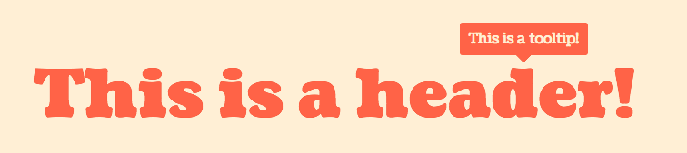

# A Crash Course in Selectors: Part 2

## What are Pseudo-Classes?

Pseudo-classes are specific attributes or properties of an element that can be used to make styling more robust, streamlined, and responsive to user interaction. All of this can be done without the added bloat of javascript, and provides a lot of value with minimal overhead.

All pseudo-selectors are displayed with a colon (`:`) as its prefix. You might also see the double colon (`::`) used in certain selectors. This was introduced in CSS3 to differentiate between pseudo-classes and pseudo-elements, the difference being that pseudo-elements can insert their own HTML and take up their own space in the DOM (a good example of this is [`::before`](#before)).

## States

Pseudo-classes are classes that get applied to DOM elements when they are in a certain state, like when a mouse is hovering over the element. This class doesn't show up in the HTML. They can be styled like this:

```
a:hover {
  text-decoration: underline;
}
```

Any CSS declarations that can be made on the element itself can also be made on the pseudo-class. These are used to indicate to the user what state they are in in their interaction with the link. This also works with buttons.

### `:link`
This is the default state for links. It is the pseudo-class that's applied to links before you ever interact with them.

### `:hover`
This one is fairly self-explanatory, but this pseudo-class is applied when the mouse is hovering over the element. It is used to indicate that the element is interactive, and that the user can expect something to happen when they click on it. Hover is a special state because it can work on **any element** in the DOM.

### `:active`
This pseudo-class is applied to an element while the element is being clicked on. Its only applied when the mouse is over the element and it is being pressed. Usually button clicks are pretty fast, so this class isn't applied for very long.

### `:visited`
Once an element has been clicked, this will become the new default state for that link. It is useful in blogs and similar sites, where you don't want your users to waste time visiting content that they have already seen.

Putting it all together:


Here is a codepen [demo](http://codepen.io/raemadeline/pen/MyNXqx) for the gif above.

### `:focus`

Focus is a special stateful pseudo-class because it can be applied to `<a>`s, `<buttons>`s, `<input>`s and `<textarea>`s. It refers to an element that is targeted by the keyboard or activated by the mouse. Its also used when "tabbing" through elements in a page to highlight which element is in focus at a given time. The default styling for `:focus` varies by browser, but it is usually an outline around the element. If you use chrome, you are probably familiar with this blue glow:


While you might think that this blue outline clashes with your style, and you might want to remove the default styling, it is important to have _some_ styling on `:focus`-able elements. This is because it is very beneficial for usability, as many people use only the keyboard and need to see which element is in focus at all times.

### `:disabled`

HTML inputs and buttons can be disabled by adding the word `disabled` to their tag, like this `<button disabled>Don't Click Me!</button>`. This attribute prevents the user from interacting with that element. By default, the pointer (which is usually an arrow, but becomes a pointing finger on clickable elements), will stay an arrow, and default (provided by the browser) hover and other interaction styling will be removed. This pseudo-class should be styled in a way that conveys to the user that this element cannot be interacted with.

There is also an `:enabled` pseudo-class that acts as the negation of the `:disabled` class.

## Position and Index-Based Classes

### `:root`

This pseudo-class applies to the element at root level in the page. In most cases, this refers to the `<html>` tag at the start of every file, but it can also refer to something else when using other markup languages like SVG and XML. This pseudo-class can be used to set base styling for the entire document.

Why would you want to use this instead of directly targeting the root element itself? The pseudo-class is less specific than directly targeting the element (stay tuned for Part 4 where I explain specificity).

### `:nth-child(N)`

Let's assume we have an HTML page that looks like this

```
<ul class="fruits-vegetables">
  <li>Avocado</li>
  <li>Beets</li>
  <li>Carrots</li>
  <li>Dill</li>
  <li>Eggplant</li>
  <li>Fennel</li>
  <li>Grapefruit</li>
  <li>Honeydew</li>
</ul>
```

Say we wanted to specifically target `Beets`, we could use this as our CSS:

```
.vegetables :nth-child(2) {
  color: purple;
}
```

`:nth-child(N)` is one-indexed, and can target any child element with that index, assuming there are that many children of the parent. You can also target `:nth-child(even)` and `:nth-child(odd)`.

If you wanted to get even more customized, you can do anything in the format of `:nth-child(an+b)`, where `a` is the multiplier and `b` is the offset. For instance, if you want to target `Carrots`, `Eggpplant`, and `Grapefruit`, you can do `:nth-child(2n + 3)`.

In a similar vein, you can also do the same thing but counting backwards from the end of the list using `:nth-last-child(N)`, using it the exact same way as you would `:nth-child(N)`.

For simplicity for commonly used selectors, you can substitute `:first-child` for `:nth-child(1)`, and `:last-child` for `:nth-last-child(1)`.

You can also use `:only-child` to target elements who are the only child of the parent. For example,

```
<div>
  <p>Hooray!</p>
</div>
<div>
  <p>Hello world!</p>
  <p>Hello again!</p>
</div>
```

with this as your CSS:

```
p:only-child {
  background-color: blue;
}
```

only the line `Hooray!` would be highlighted blue.

### `:nth-of-type(N)`

`:nth-of-type(N)` is very similar to `:nth-child(N)`, but with the added specificity of type-checking. Say you are styling a form that looks roughly like this:

```
<form>
  <label>Label 1</label>
  <input type="text"></input>
  <label>Label 2</label>
  <input type="text"></input>
  <label>Label 3</label>
  <input type="text"></input>
  <label>Label 4</label>
  <input type="text"></input>
  <input type="submit">Submit</input>
</form>
```

You could style the second label like this:

```
label:nth-of-type(2) {
  color: orange;
}
```

There are also other corresponding selectors, `:first-of-type`, `:last-of-type`, `:nth-last-of-type(N)`, `:only-of-type`.

## Relational Pseudo-classes

### `:empty`

This selector refers to any element who does not contain any inner HTML. So with this HTML:

```
<div></div>
<div>Hello!</div>
```

Only the first `<div>` would be selected by `:empty`.

### `:not(S)`

This pseudo-class can be used to negate any other pseudo-class, as well as negating additional classes or attributes.

Here are a a few examples:

- `li:not(:last-child)` to select all but the last item in a list.
- `input:not(:disabled)` to select all editable inputs
- `.class-name:not(.other-class-name)` to deselect elements with `other-class-name` from the initial selector.

## Text-related Pseudo-Elements

Here's a [codepen demo](http://codepen.io/raemadeline/pen/EyayjJ) to further explain this section.

### `::first-letter`

This can be used to style drop-caps and other customizations, it targets the first letter in a block of text.

### `::first-line`

Similar to `::first-letter`, this selects the first line in a block of text. What is considered the first line is based on the width of the DOM element, not necessarily if there are line breaks within the text.

## Content-related Pseudo-"Elements"

### `::before`

The `::before` element is used to add content at the beginning of an element. This content isn't really in the DOM (so be mindful of accessibility!). For it to appear, you must define a `content` property on the selector like this:

```
h1::before {
  content: "Hello, ";
}
```

You can also do the same thing, but appended to the end of the element using `::after`.

[Codepen Demo](http://codepen.io/raemadeline/pen/OXPbbV)

You can also set `content: ""` if you don't want to add actual content, but you do want to add a shape, or mess around with the alignment (there is a popular  clearfix [hack](http://nicolasgallagher.com/micro-clearfix-hack/) using `::after`). You can also use `::before` and  `::after` to create custom bullet points and add arrows to tooltips.



[Codepen Demo](http://codepen.io/raemadeline/pen/KMwZRw)

## Pseudo-Classes on Inputs

Inputs have pseudo-classes applied to them based on the values inside them.

### `:checked`

This one is for checkboxes and radio elements. It is triggered when the input element is checked.

### `:in-range`, `:out-of-range`

This one is specifically for number inputs. If this is your HTML:

```
<input type="number" min="5" max="10">
```

You can conditionally style based on whether the value in the input is within that range.

[Codepen Demo](http://codepen.io/raemadeline/pen/zBxoaJ)


## Fun Combinations

These pseudo-classes can be used with combinators (check out [Part 1](1_selectors.md) if you forget what that means), and I thought I'd show a few fun examples to demonstrate.

* `a:not(:visited)`: All links that haven't been seen yet
* `input:out-of-range:focus`: You might put an error state on an input with invalid text, but you want it to go away when a user is typing.
* `p:first-child:first-letter`: Adding a drop cap to the first letter of the first paragraph of an essay.
* `:root::before`: Adding content before the start of the DOM
* `li:nth-child(N)::before`: Adding custom bullet points to lists

## Conclusion

This whole post may seem like a lot, but there are actually way more I didn't cover (mostly because they aren't used very often). If this is something that interests you, I recommend checking out the [documentation](https://developer.mozilla.org/en-US/docs/Web/CSS/Pseudo-classes), and trying some out on your next project.

**Keep an eye out for Parts 3 and 4 of this blog post where I will discuss more advanced selectors that can be used with SASS (a beautiful CSS preprocessor)n and specificity in CSS selectors.**
