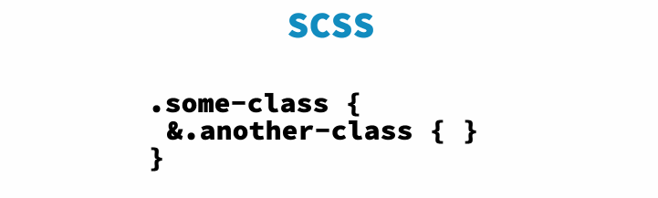

# A Crash Course in Selectors: Part 3

Up until this point, I have only been covering features that can be used in pure, out of the box CSS. While CSS can do a lot on its own, there are a bunch of really powerful pre-processors that compile into CSS that allow developers to iterate faster, build more complex systems with less code, and save a lot of time and energy.

At Addepar, we use [SASS](http://sass-lang.com/), a pre-processor "with superpowers", to borrow their language. SASS has a ton of awesome features, most of which deserve their own blog post. In the spirit of continuing our conversation on selectors, I thought I'd highlight the ways you can play around with selectors using SCSS syntax.

## A note about SASS vs SCSS
A lot of the time you will see SASS files with the file extension `.scss`. This denotes a file with *Sassy CSS* syntax. The difference being that any valid `.css` file can be read by an SCSS compiler and it will produce itself. There are some additional differences between SASS and SCSS, the largest of which being that SASS does not require curly braces, instead using tabs (similar to Python).

For this post (and all following, unless I specify otherwise), I will be using SCSS syntax. If you're interested in learning more about the pro's and con's of each syntax, read this article [here](http://thesassway.com/editorial/sass-vs-scss-which-syntax-is-better).

## Nesting

One of the most annoying parts about writing vanilla CSS is that it's very hard to keep organized without tons of documentation, especially in a large system. A big part of why this is messy, is that its hard to tell which elements are children of which parents, so elements will inherit unexpected styling thats difficult to debug.

In SASS, you can nest selectors like this:

```
.parent {
  /* styling goes here */

  .descendant {
    /* descendant-specific styles go here */
  }
}
```

And it will get compiled into CSS that looks like this:

```
.parent {
  /* styling goes here */
}

.parent .descendant {
  /* descendant-specific styles go here */
}
```

Note that I'm using `descendant` instead of `child`, because this nesting works for any descendant of the parent, not just its direct children.

For added specificity, you can also use this nesting with any parent and any descendant selectors (see [A Crash Course in CSS Selectors: Part 1](1_selectors.md) if you need a refresher).


## The Ampersand

If you want to get more ambitious than just nesting children from parents, you can use an ampersand (`&`) as a concatenator within nested SASS structures. There are some other idiosyncrasies with the `&`, so we will go into each of them with more detail.



*Image via css-tricks.com*

As a simple example, let's revisit the above example and how we could use an ampersand to accomplish the same task.

```
.parent {
  & .descendant {
    /* styles */
  }
}
```

Is the exact same as

```
.parent {
  .descendant {
    /* styles */
  }
}
```

Because they both compile to

```
.parent .descendant {
  /* styles */
}
```

Note that this is not the preferred way to nest child selectors (I prefer the first method outlined above, as it is much cleaner). This is just an example of how the ampersand can be used. This method is not wrong, its just unnecessary when a simpler way is also available.

### Added Specificity

A common use case for the `&` is to add specificity under certain cases. For example, say you have a div that always has the class `.demo`, but under certain cases (determined by your javascript code), it also has the class `.special`. You want the `div` to always be styled using the `.demo` CSS but sometimes you want `.special` styles *also*.

See the [codepen demo](http://codepen.io/raemadeline/pen/ZObaba) for a real example. In codepen, you can toggle between viewing the SCSS and the compiled CSS, so you can see how your code compiles :)

You might have noticed that this demo would have worked just as well if you never nested the styles

```
.demo {
  /* demo styles */
}

.special {
  /* special styles */
}
```

And within that example, this is true. There's no need (and often its not desired) to style on a more specific selector than a more general one (stay tuned for my blog post on specificity!). Sometimes it is needed, so I'm showing this demo more as a proof of concept than as a guide for how things should *always* be done.

### Pseudo-Classes

If you had noticed the styling on the button in the [codepen demo](http://codepen.io/raemadeline/pen/ZObaba) above, you'd see that I used the `&` selector to nest the pseudo-selectors for the button within the styling for the button.

```
button {
  /* normal styles */

  &:hover {
    /* hover styles */
  }
}
```

Compiles into

```
button {
  /* normal styles */
}

button:hover {
  /* hover styles */
}
```

Sure, you could just write out the compiled CSS and it would still work, but from a readability standpoint it is easier to keep track of code when it is nested well into organized components.

### Modifier Classes

The ampersand does not just concatenate selectors, it can also concatenate words to form selectors. Suppose you're building a complex design system that includes several different buttons, all of which have their own classes (currently in Addepar, we have `btn`, `btn-link`, `btn-icon`, and several others).

You can write SCSS to keep all these styles together and well organized:

```
.btn {
  /* base button styling here */

  &-link {
    /* styling for buttons that should look like links */
  }

  &-icon {
    /* styling for buttons with icons in them */
  }
}
```

And as you could probably guess, this compiles nicely into:

```
.btn {
  /* base button styling here */
}

.btn-link {
  /* styling for buttons that should look like links */
}

.btn-icon {
  /* styling for buttons with icons in them */
}
```

This feature is especially useful if you're working on a project that uses [BEM notation](http://getbem.com/introduction/), which is a very useful system of organization, but we do not use it within Addepar so I won't cover it in depth here.

### Contextual Selecting

In some ways, the `&` selector can be thought of as using `this` within SCSS instead of just thinking of it as a concatenator.

Suppose you wanted to style all headers to look a certain way, but if they're inside a panel, they should be **bold**.

You can use SCSS and `&` to do this:

```
h1 {
  font-size: 24px;
  font-family: Helvetica, sans-serif;

  .panel & {
    font-weight: bold;
  }
}
```

The above SCSS compiles into this CSS:

```
h1 {
  font-size: 24px;
  font-family: Helvetica, sans-serif;
}

.panel h1 {
  font-weight: bold;
}
```

This is useful when you're styling things that have a core styling, but are modified given the context they are in.

### Siblings

Extending the notion of the ampersand (`&`) being treated as a `this`, you can also use the ampersand to do a cool trick to select all siblings:

Suppose you have a group of buttons in a navigation menu and you want all of them to line up nicely as a group, without having to add another class.

```
button {
  /* normal button styling */
  margin-right: 20px;

  & + & {
    margin-right: 0;
  }
}
```

This compiles into:

```
button {
  /* normal button styling */
  margin-right: 20px;
}

button + button {
  margin-right: 0;
}
```

[Codepen Demo](http://codepen.io/raemadeline/pen/gMaoaR)

This trick isn't needed very often, but when it applies it can save you a bit of time and effort.

**Next Up: Specificity in CSS Selectors**
